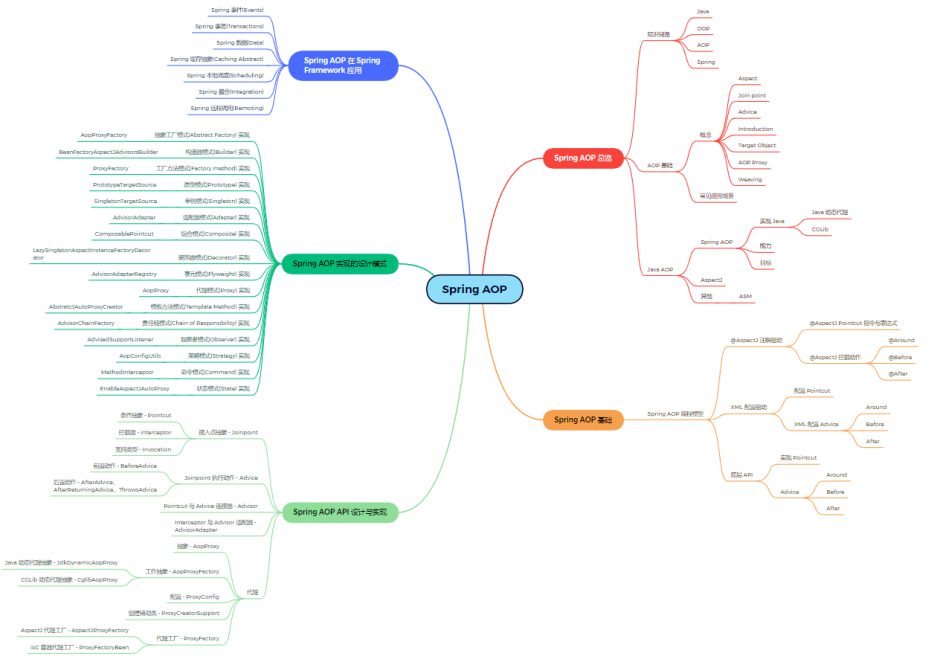

# Thinking In Spring —— 💠 Spring Framework 总览

> 🦍 Spring 核心特性 学习大纲

> 🦍 Spring AOP 学习大纲

## Spring Framework 总览

> 大纲总览

- 课前准备
- Spring 特性总览
- Spring 版本特性
- Spring 模块化设计
- Spring 对 Java 语言特性运用
- Spring 对 JDK API 实践
- Spring 对 Java EE API 整合
- Spring 编程模型
- Spring 核心价值
- 面试题精选

# Spring 特性总览

💧 **心态**

**1️⃣ 戒骄戒躁**

**2️⃣ 谨慎豁达**

**3️⃣ 如履薄冰**

**🔖 方法**

**1️⃣ 基础：夯实基础，了解动态**

**2️⃣ 思考：保持怀疑，验证一切**

**3️⃣ 分析：不拘小节，观其大意**

**4️⃣ 实践：思辨结合，学以致用** 

**🧰 工具**

**1️ JDK：Oracle JDK 8**

**2️⃣ Spring Framework：5.2.2.RELEASE**

**3️⃣ IDE：IntelliJ IDEA 2022.2.3（Community）**

**4️⃣ Maven：3.2+**

# Spring 核心特性

核心特性（Core）
1️⃣ IoC 容器（IoC Container）
2️⃣ Spring 事件 （Events）
3️⃣ 资源管理（Resources）
4️⃣ 国际化（i18n）
5️⃣ 校验（Validation）
6️⃣ 数据绑定（Data Binding）
7️⃣ 类型转换（Type Conversion）
8️⃣ Spring 表达式（Spring Express Language）
9️⃣ 面向切面编程（AOP）
****
数据存储（Data Access）
1️⃣ JDBC
2️⃣ 事务抽象（Transactions）
3️⃣ DAO 支持（DAO Support）
4️⃣ O/R 映射（O/R Mapping）
5️⃣ XML 编列（XML Marshalling）
****
Web 技术（Web）
1️⃣ Web Servlet 技术栈
● Spring MVC
● WebSocket
● SockJS

2️⃣ Web Reactive 技术栈
● Spring WebFlux
● WebClient
● WebSocket
****
技术整合（Integration）
1️⃣ 远程调用（Remoting）
2️⃣ Java 消息服务（JMS）
3️⃣ Java 连接架构（JCA）
4️⃣ Java 管理扩展（JMX）
5️⃣ Java 邮件客户端（Email）
6️⃣ 本地任务（Tasks）
7️⃣ 本地调度（Scheduling）
8️⃣ 缓存抽象（Caching）
9️⃣ Spring 测试（Testing）
****
测试（Testing）
1️⃣ 模拟对象（Mock Objects）
2️⃣ TestContext 框架（TestContext Framework）
3️⃣ Spring MVC 测试（Spring MVC Test）
4️⃣ Web测试客户端（Web Test Client）
